<!-- _class: lead big -->
# Databases in Ethereum Nodes <br> ft. ErigonDB

by M Sudeep Kumar

---

<!--
_class: big

### what is ethereum?

- blockchain: decentralized participation in the network to determine what blocks and transactions to be added next.
- adversarial environment
- ethereum staking provides a new tool to drive "proper" behavior of participating nodes
- bitcoin does decentralization of value transfer; ethereum does decentralization of arbitrary execution (Ethereum Virtual Machine), enabling notion of "programmable money"


---
-->

<!-- _class: big -->
### Erigon and Archive node
- different kinds of ethereum nodes - validators, archive nodes, minimal nodes
- Erigon specialization in archive nodes
    - node size: 2TB archive (8TB including commitment history)
    - sync time: hours instead of days
    - RPC performance: favorite choice of API/RPC providers and indexers

---

<!-- _class: lead big -->
what data has to be stored? <br>access patterns?<br>other special requirements?

---

### Blocks and Transactions
<!-- _class: lead -->
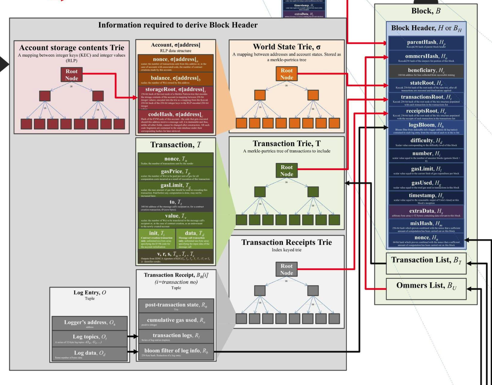

---
<!-- _class: big -->

### data and access patterns: RPC

- `GetBlock(blockHash/blockNumber)`
- `GetTransactionsOfBlock(blockHash/blockNumber)`
- `GetTransaction(txHash)`

---

### accounts and storage
<br>
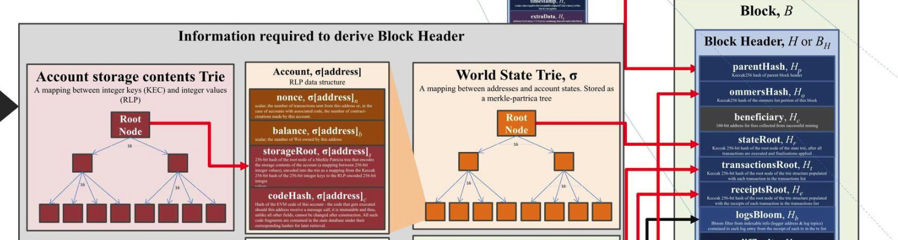

---

### accounts: Smart Contract
<br>


---

### accounts: Smart Contract
<br>


---


<!-- _class: big -->
### data and access patterns
#### latest state

- `GetAccount(address) -> Account`
- `GetStorageForAccount(address) -> []<StorageSlot, Value>`
- `GetStorageValue(address, StorageSlot) -> Value`


#### blocks and transactions queries
- GetBlock(blockHash/blockNumber) -> Block
- GetTransactionsOfBlock(blockHash/blockNumber) -> []Transaction
- GetTransaction(txHash) -> Transaction


---
#### historical state
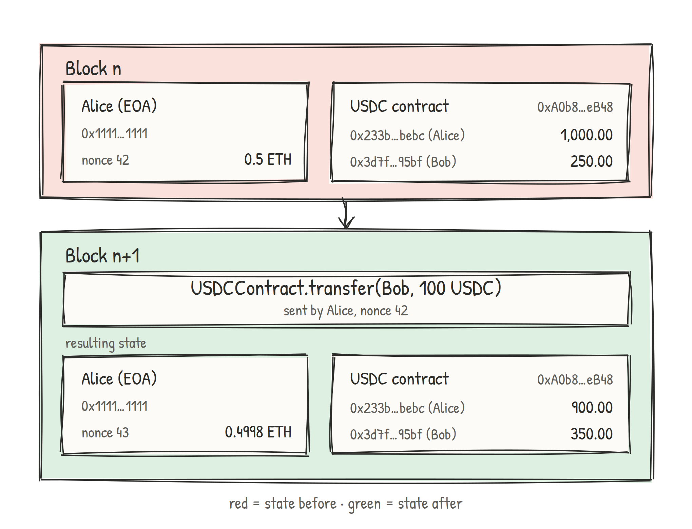

---

### data and access patterns

#### historical state
- `GetAccount(address, blocknumber) -> Account`
- `GetStorageForAccount(address, blocknumber) -> []<StorageSlot, Value>`
- `GetStorageValue(address, StorageSlot, blocknumber) -> Value`

#### latest state
- special case of historical state, with blocknumber = "latest"

#### blocks and transactions queries

---
<!-- _class: big -->

### data and access patterns

- temporal dimension of stored data
    - value of account/storage as of block `Q`

- blocks and transactions are relatively simpler


---

### data and access patterns

#### (un)finalized and chaintip performance

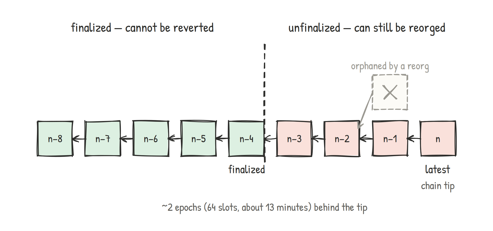

---

### database dilemma: finalized blocks

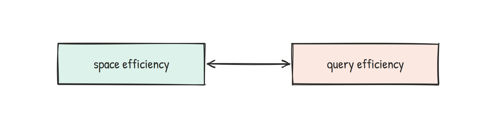

---


---

### database trilemma: unfinalized blocks


---
<!-- _class: big -->

### properties

- **trilemma vs dilemma**
- temporality: historical vs latest state
- chain tip performance
- distribution
- SSD/HDD tiering

---

### LSM-like structure

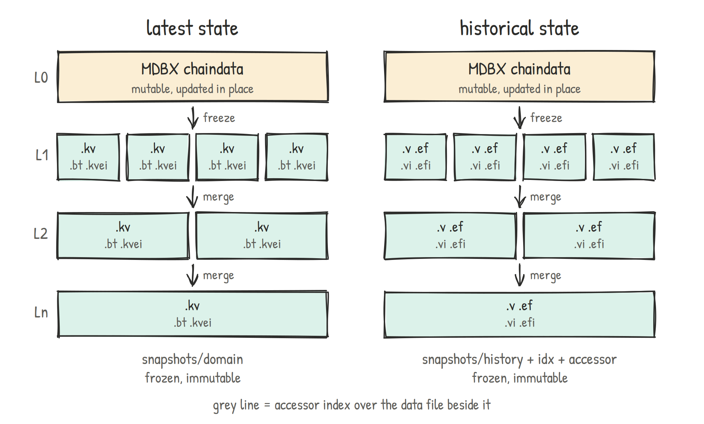

---
<!-- _class: big -->

### L0 - MDBX

- KV database, transactional, embedded
- B+-tree
- mmap based
- writer serialization
- reading and writing don't get blocked on each other

---

### mmap


- alternative to syscall-based file I/O - `read()`/`write()` APIs
- caching layer = OS page cache
- used by MDBX and snapshot files
- hints can be provided with `madvise` APIs

---
<!-- _class: big -->

### properties

- trilemma vs dilemma: **LSM-like structure**
- temporality: historical vs latest state
- chain tip performance
- distribution
- SSD/HDD tiering

---

### erigondb's temporal nature


---
<!-- _class: big -->

### erigondb's temporal nature

- what is the value of account X on block 10000
- what were the state changes when transaction index 1 is executed on block 100?

---
### erigondb's temporal nature

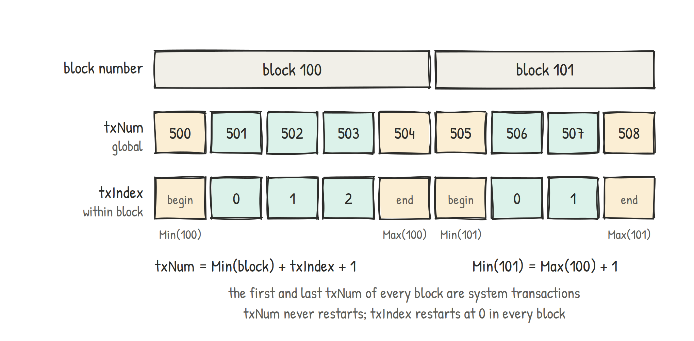

- txnum vs block number
  - impact on historical queries
- effect on state size
- user knows about (block number, transaction index)
  - erigondb translates it to txnum


---
<!-- _class: big -->

### erigondb's temporal nature: historical queries

- inverted index
  - account address -> list of transaction numbers where account was changed
  - storage slot    -> list of transaction numbers where storage slot was changed

---
<!-- _class: big -->

### erigondb's temporal nature: historical queries

- needs to answer: `Get(account X, txnum=100)`
- using II:   what is the txnum `T` at which account X change s.t. `T>100`
- then: `Get(X || T)` on the KV store

---
### historical state queries


---

### Recsplit

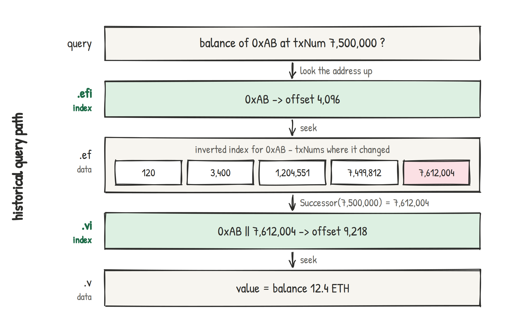


---
### Recsplit


---
<!-- _class: big -->

### Recsplit

- minimal perfect hash function (MPHF) algorithm
- fixed set of keys (can't be changed once constructed)
- uses recursive splitting to map set of keys to first $|S|$ integers without collisions.
- 1.56 bits per key (theoretical bound is 1.44 bits per key)

---

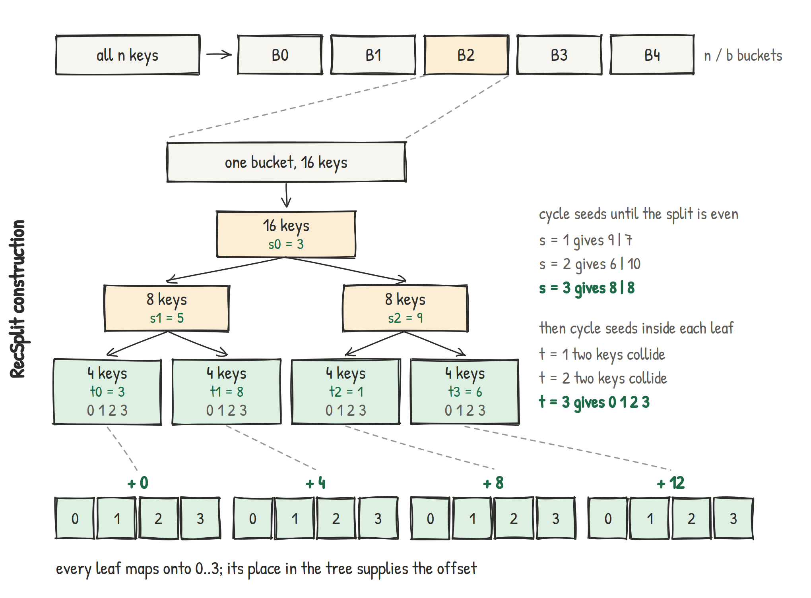

---
<!-- _class: big -->

### Recsplit

- why recursive splitting?
- probablity of finding bijection into ${0, 1, ..., n-1}$ is $n!/nⁿ ≈ √(2πn) · e⁻ⁿ$
- make $n$ small => can rely on brute force to find bijection

---

#### Recsplit

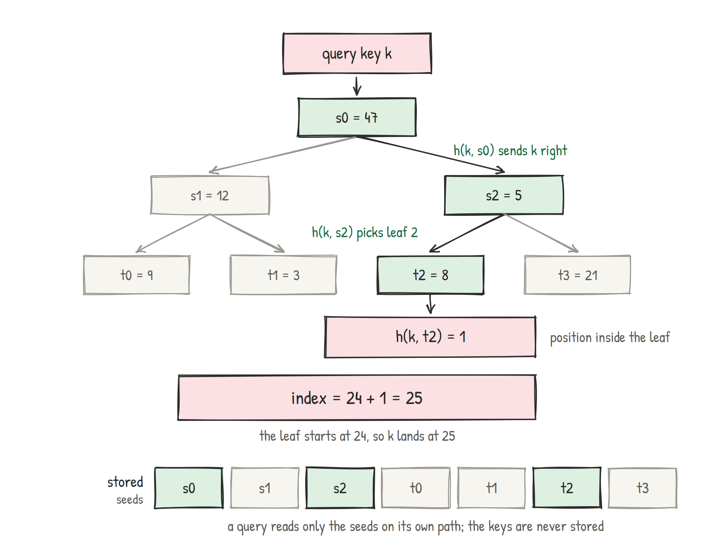

---
<!--
_class: big


### Recsplit

- no need to store keys => non-existence keys still returns some offset
- can store keys in values file OR key is derivable from value
- to avoid above, use existence filter

---
-->


### Recsplit


---

### inverted index: elias-fano encoding

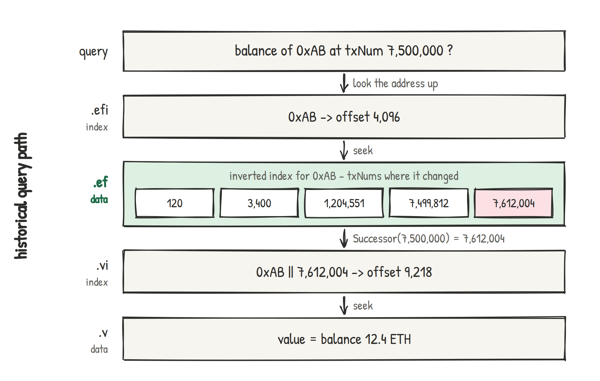

---

### inverted index: elias-fano encoding


---

### inverted index: elias-fano encoding

- <small>succint data structure; near-optimal space</small>
- <small>exploit fact that consecutive values have same MSBs</small>
- <small>$n$ = 8 values; $U$=63; split into high/low bits at $log(U/n)$</small>
```
3 = 000|011      7 = 000|111
12 = 001|100     13 = 001|101
24 = 011|000     31 = 011|111
48 = 110|000     55 = 110|111
```

---
<!-- _class: big -->

### inverted index: elias-fano encoding


- <small>encode high bits separately: write the bucket counts in unary `(2,2,0,2,0,0,2,0)`</small>
```
110 110 0 110 0 0 110 0
```
- <small>low bits are random: store them as is</small>

---


### inverted index: elias-fano encoding


---


---

### sparse btree index

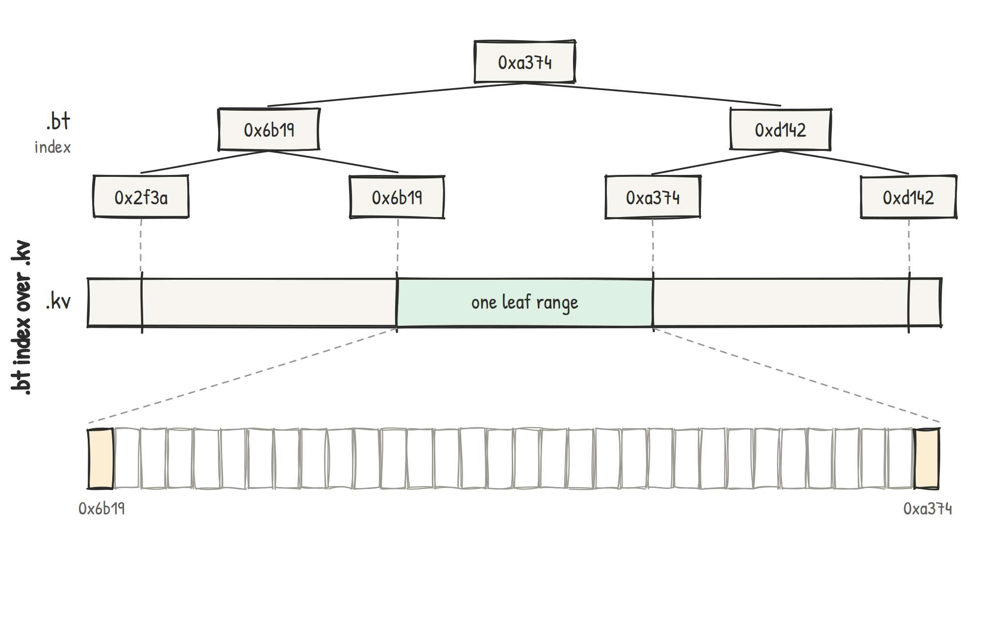

---

### sparse btree index: binary search

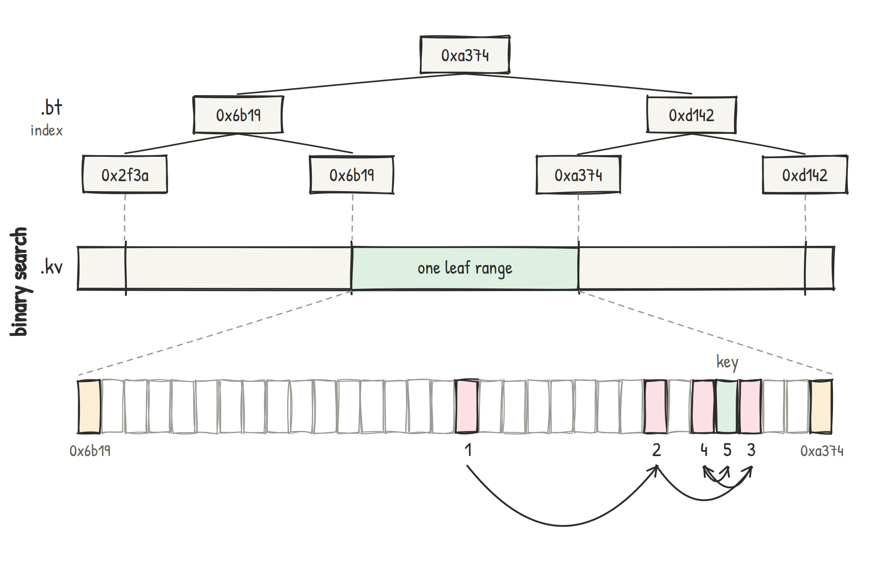

---

### sparse btree index: interpolation search

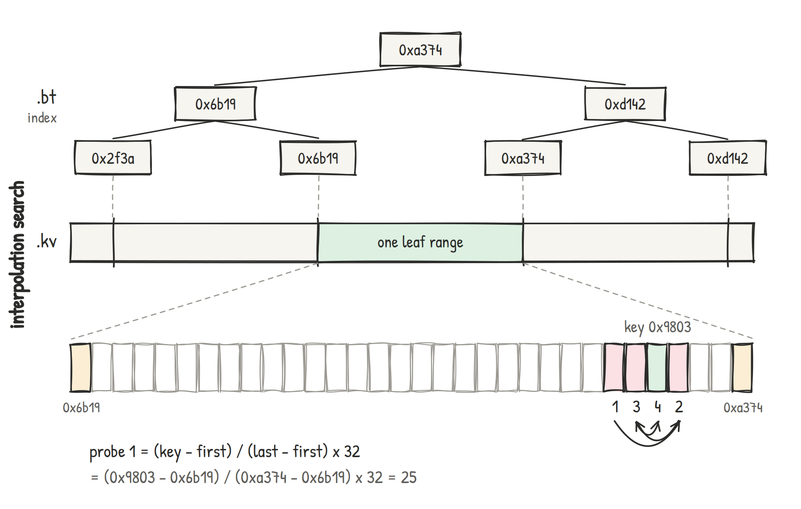

---

### sparse btree index vs recsplit

- range queries: "storage slots for an account"
- 3x smaller than recsplit
    - recsplit offsets are not sorted => incompressible;
    - btree offsets are EF compressible
- performance similar to recsplit on uniformly distributed data
- for commitment: lopsided data performs worse

---


### properties

- trilemma vs dilemma
    - LSM-like structure
- temporality: historical vs latest state
    - **recsplit; sparse btree; elias-fano**
- chain tip performance: node must be able to follow chaintip
    - recsplit; sparse btree
    - pause background db maintenance; caching
- distribution
- SSD/HDD tiering

---

### distribution

- syncing a node
- snapshot files
    - release cadence
    - sync in hours, rather than days
    - torrent distribution
- why custom snapshot files?
    - fine tune performance
    - want same snapshot produced on different machines

---

### directory layout tricks

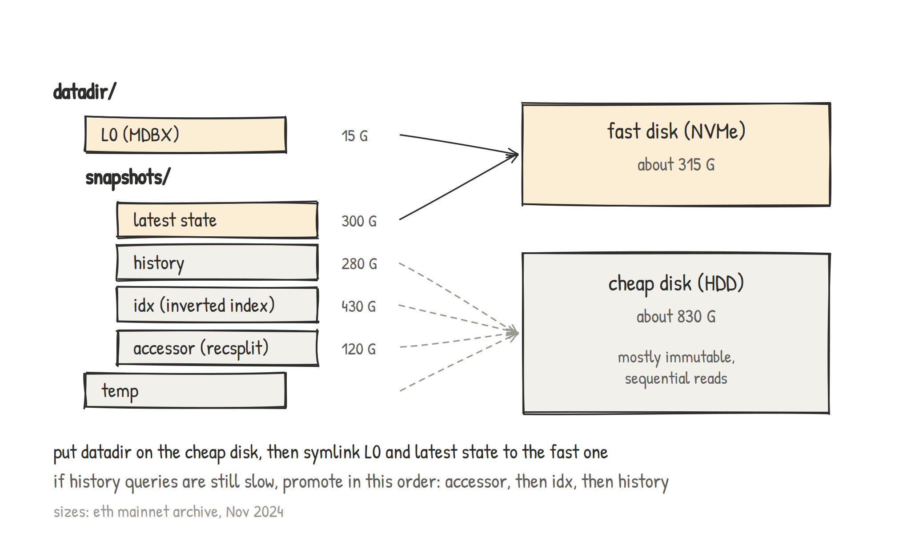

---
<!-- _class: lead -->
<!-- _footer: created using marp - the markdown presentation app -->

# THE END
<br><br>

