# Databases in Ethereum Nodes ft. ErigonDB

by M Sudeep Kumar

---

# what is ethereum?

- decentralized distributed system: participate in the network to determine what blocks and transactions are to be added next. Ensure amicable behaviour of other participants.
- bitcoin does decentralization of value transfer; ethereum does decentralization of arbitrary execution (Ethereum Virtual Machine), enabling notion of "programmable money"

---

ethereum protocol development, and position of erigon in it
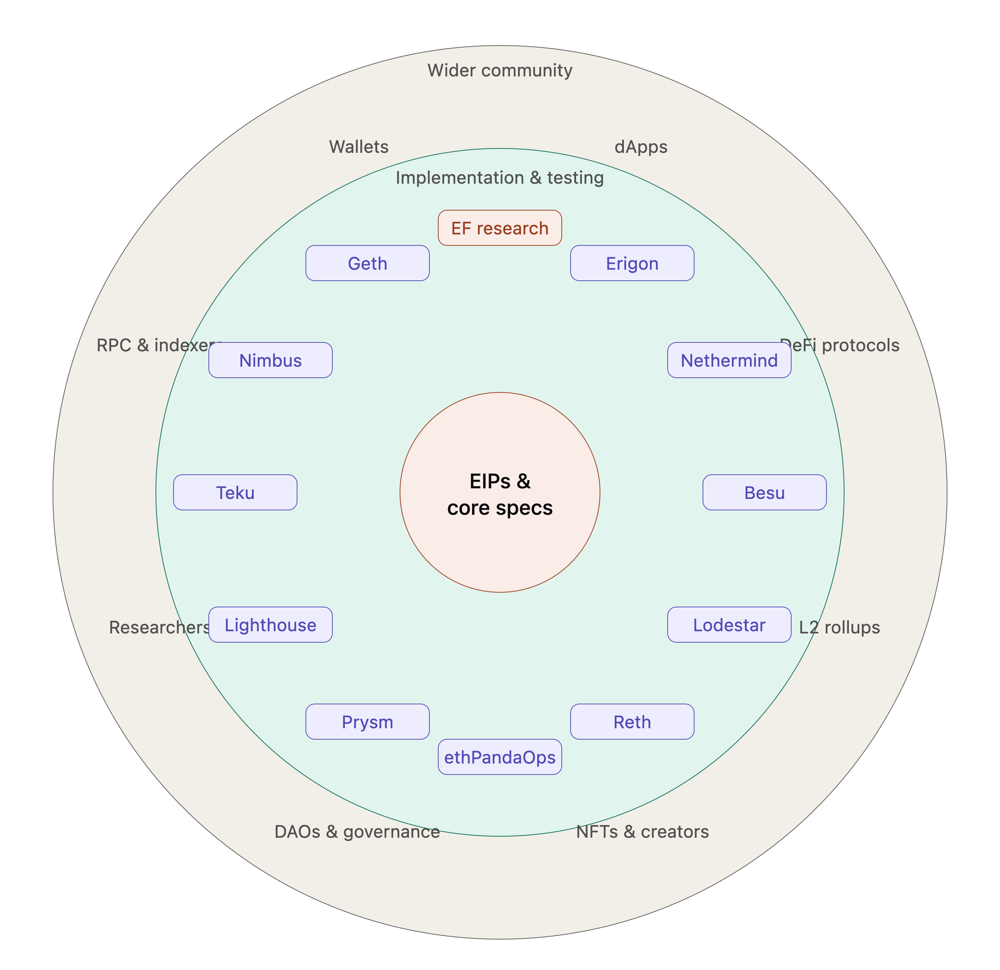

---

different kinds of ethereum nodes - validators, archive nodes, minimal nodes
erigon specialization in rpc nodes - used by API providers, indexers; validators

---

what kind of data has to be stored and served? what are the access patterns?

---


---

# data and access patterns: RPC

- `GetBlock(blockHash/blockNumber)`
- `GetTransactionsOfBlock(blockHash/blockNumber)`
- `GetTransaction(txHash)`

---

# accounts and storage


---

# accounts: EOA and Smart Contract

- EOA: "bank account" - balance (ETH); can initiate transactions
- Smart Contract: have code and storage; do not initiate transactions

---

# accounts: Smart Contract
<br>
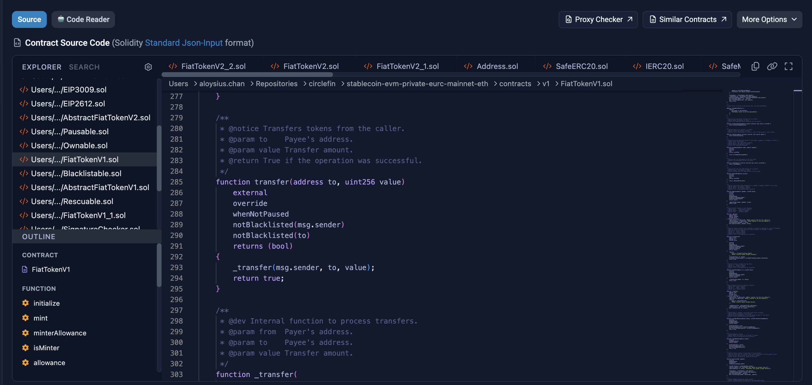

---

# accounts: Smart Contract
<br>
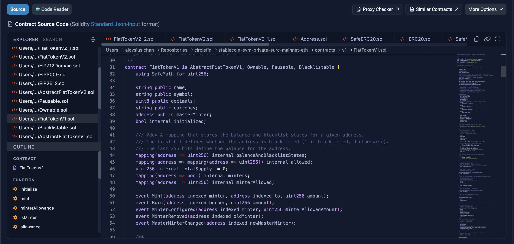

---

# data and access patterns

### latest state

<br>
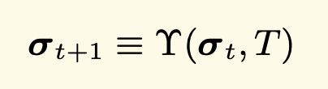

---


# data and access patterns

// maybe make these boxes

### latest state
- GetAccount(address) -> Account
- GetStorageForAccount(address) -> []<StorageSlot, Value>
- GetStorageValue(address, StorageSlot) -> Value


### blocks and transactions queries
- `GetBlock(blockHash/blockNumber) -> Block`
- `GetTransactionsOfBlock(blockHash/blockNumber) -> []Transaction`
- `GetTransaction(txHash) -> Transaction`


---

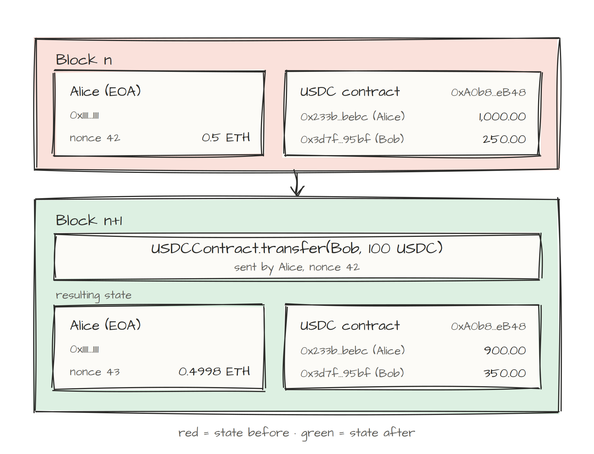

---

# data and access patterns

### historical state
- GetAccount(address, blocknumber) -> Account
- GetStorageForAccount(address, blocknumber) -> []<StorageSlot, Value>
- GetStorageValue(address, StorageSlot, blocknumber) -> Value

### latest state
- special case of historical state, with blocknumber = "latest"

### blocks and transactions queries

---

# data and access patterns

### filtering

- which blocks and transactions touch account `Q`
  - block range
  - topics

### historical state
### latest state
### blocks and transaction queries

---

# data and access patterns

- temporal dimension of stored data
    - value of account/storage as of block `Q`

- blocks and transactions are relatively simpler


---

# data and access patterns

### (un)finalized and chaintip performance

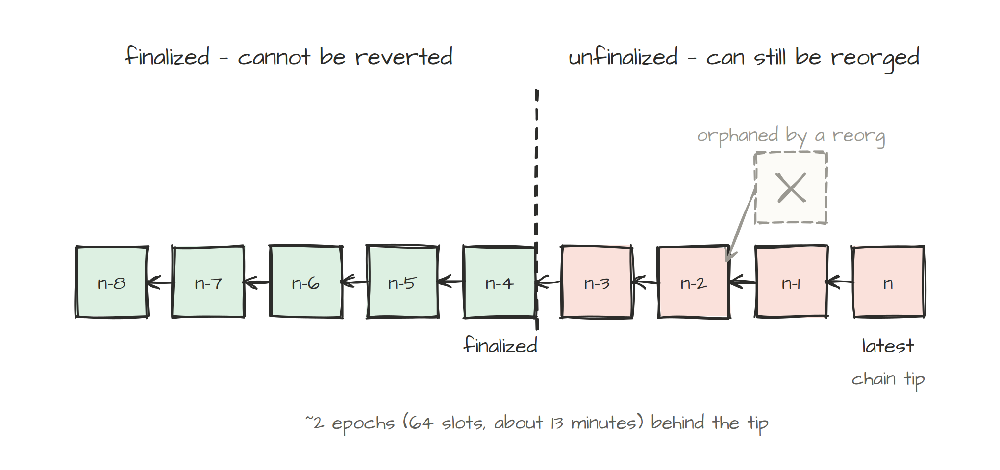

---

# database dilemma: finalized blocks


---


---

# database trilemma: unfinalized blocks

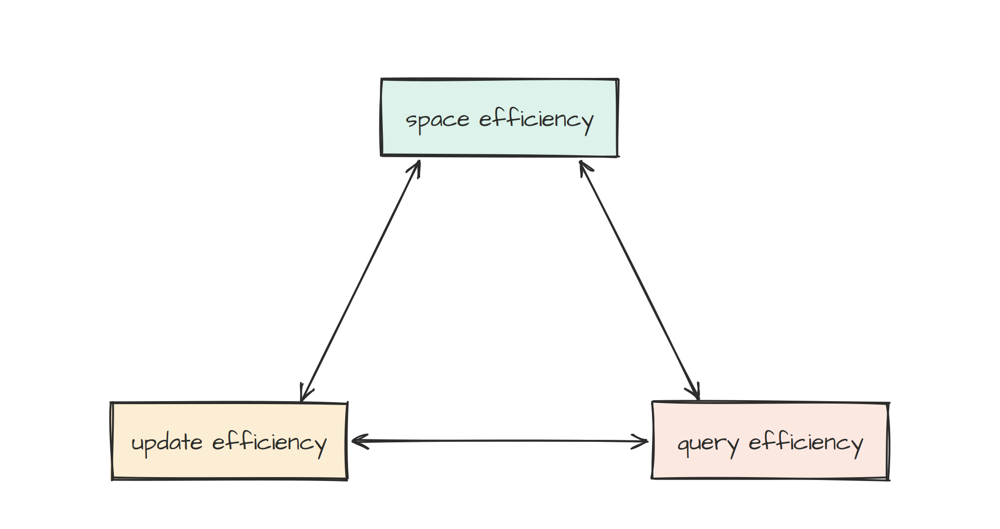

---

# properties so far

- **trilemma vs dilemma**
- temporality: historical vs latest state
- chain tip performance

---

# LSM-like structure

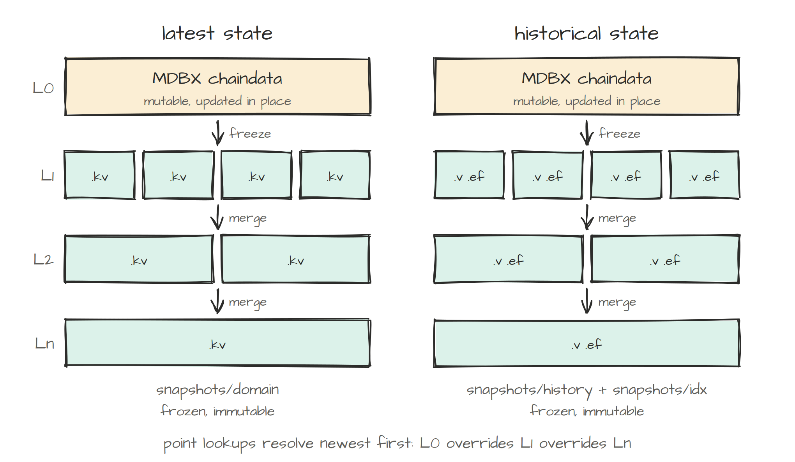

---

# L0 - MDBX

- embedded, transactional KV database
- B+-tree
- mmap based
- writer serialization
- reading and writing don't get blocked on each other

---

# mmap

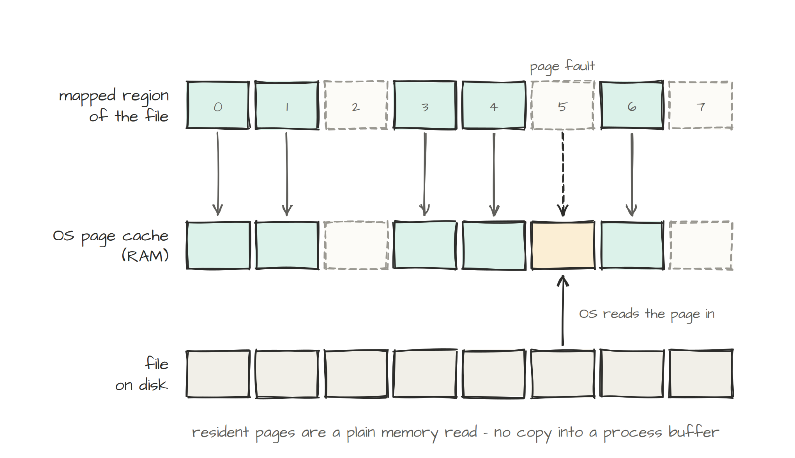

- alternative to syscall-based file I/O - `read()`/`write()` APIs
- caching layer = OS page cache
- used by MDBX and snapshot files
- hints can be provided with `madvise` APIs

---

# properties so far

- trilemma vs dilemma: **LSM-like structure**
- temporality: historical vs latest state
- chain tip performance

---

# erigondb's temporal nature


---

# erigondb's temporal nature

- what is the value of account X on block 10000
- what were the state changes when transaction index 1 is executed on block 100?

---
# erigondb's temporal nature

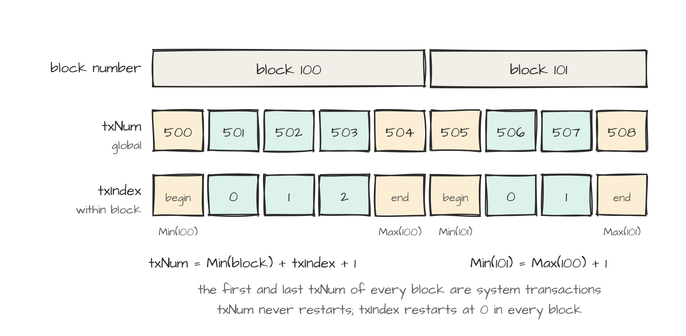

- txnum vs block number
  - impact on historical queries
- effect on state size
- user knows about (block number, transaction index)
  - erigondb translates it to txnum


---

# erigondb's temporal nature: historical queries

- inverted index
  - account address -> list of transaction numbers where account was changed
  - storage slot    -> list of transaction numbers where storage slot was changed

---
# erigondb's temporal nature: historical queries

- needs to answer: `Get(account X, txnum=100)`
- using II:   what is the txnum `T` at which account X change s.t. `T>100`
- then: `Get(X || T)` on the KV store

---
# historical state queries

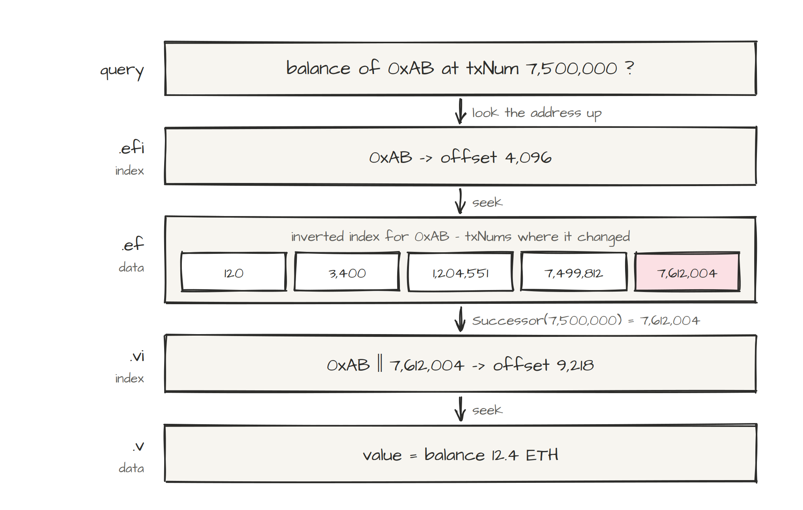

---
# Recsplit

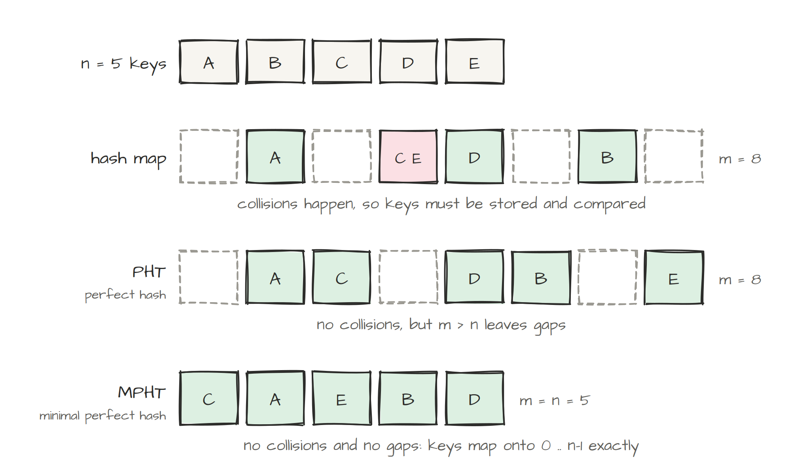

---

# Recsplit

- minimal perfect hash function (MPHF) algorithm
- uses recursive splitting to map set of keys to first $|S|$ integers without collisions.
- 1.56 bits per key (theoretical bound is 1.44 bits per key)

---

# Recsplit

- linear construction time; constant lookup time

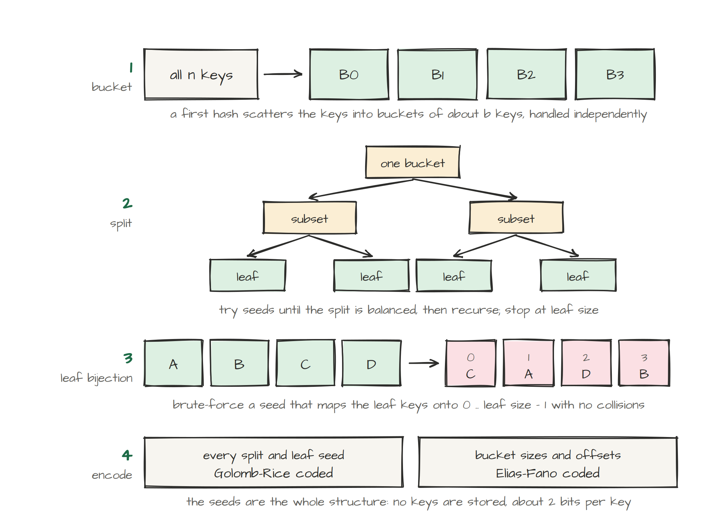

---
# Recsplit

- no need to store keys


---

# inverted index: elias-fano encoding

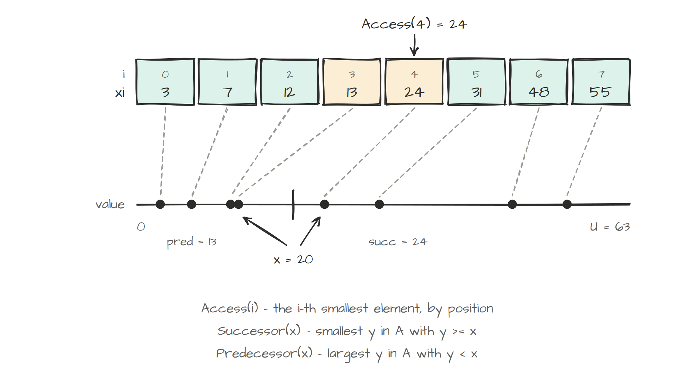

---

# inverted index: elias-fano encoding

- succint data structure; near-optimal space
- exploit fact that consecutive values have same MSBs.
- n = 8 values; U=63; split into high/low bits at $log(U/n)$
```
 3 = 000|011      7 = 000|111
12 = 001|100     13 = 001|101
24 = 011|000     31 = 011|111
48 = 110|000     55 = 110|111
```

- encode high bits separately: write the bucket counts in unary `(2,2,0,2,0,0,2,0)`
```
110 110 0 110 0 0 110 0
```
- low bits are random: store them as is

---


---

---

